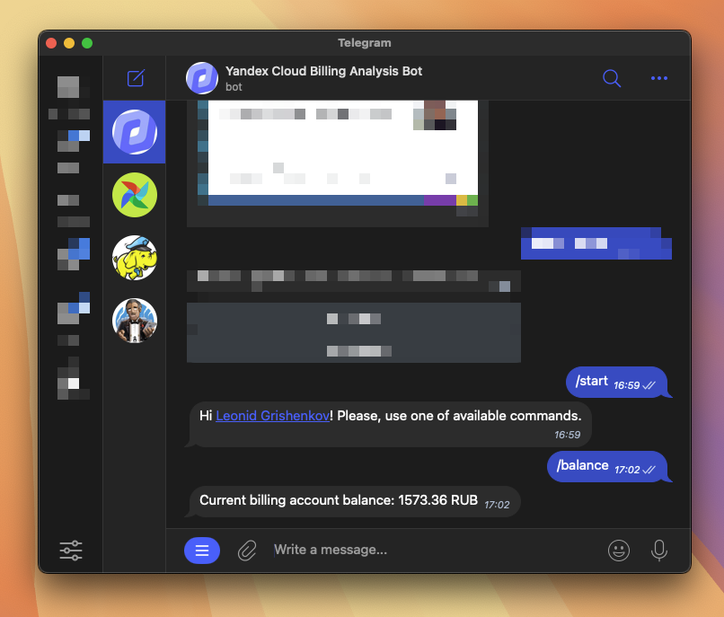
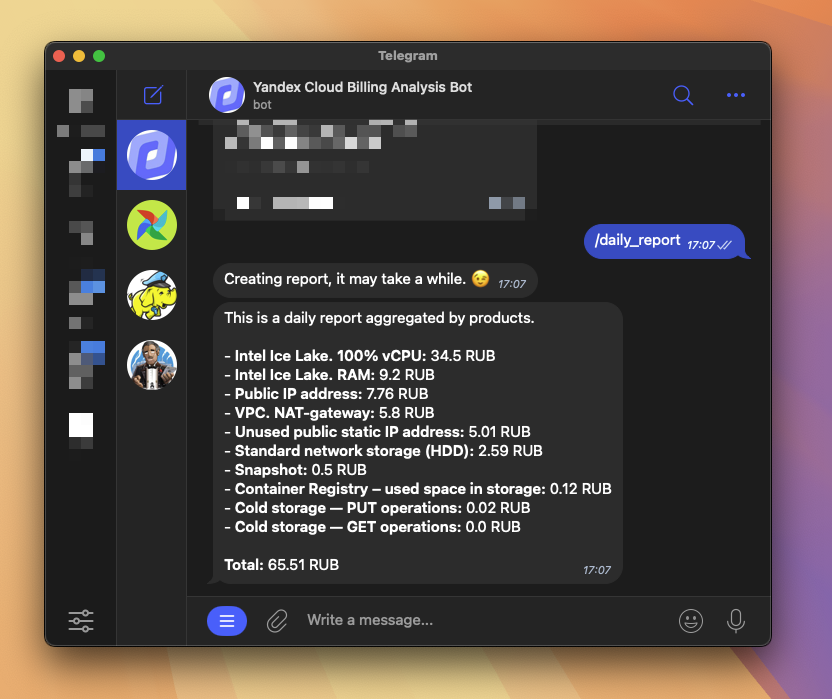
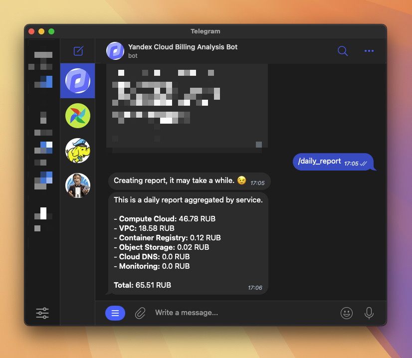

<div align="center">
  <a href="https://github.com/leonidgrishenkov/yandex-cloud-billing-analysis-bot/actions/workflows/main.yml">
    
  </a>
  <a href="https://github.com/astral-sh/ruff">
    
  </a>
  <a href="https://github.com/astral-sh/uv">
    
  </a>
</div>

# About

This is a Telegram bot that sends ad-hock reports about Yandex Cloud expense details and actual billing acount balance.

[Getting expense details by folder | Yandex Cloud](https://yandex.cloud/ru/docs/billing/operations/get-folder-report).

## Bot commands

The main bot commands:

| Command           | Description                                 |
| ----------------- | ------------------------------------------- |
| `/balance`        | Show current billing account balance        |
| `/daily_report`   | Show today's date actual consumption report |
| `/weekly_report`  | Show last 7 days consumption report         |
| `/monthly_report` | Show last 30 days consumption report        |

After each `/*_report` command you will be prompt to select how you want to aggregate data.

The posible ways are:

1. By Service
2. By Product

Which means what entity in Yandex Cloud to use in `GROUP BY` clause.

Show current balance:



Daily report prompt:


Daily report aggregated by product output:



Daily report aggregated by service output:



The same output will be for each `/*_report` command.

# Local development

Build and run the bot inside docker container.

```sh
export IMAGE=yandex-cloud-billing-analysis-bot:dev-1.0.0
```

```sh
docker build -t $IMAGE -f Dockerfile .
```

```sh
docker run --detach --rm \
    --name yandex-cloud-billing-analysis-bot \
    $IMAGE
```

Get container logs:

```sh
docker logs -f yandex-cloud-billing-analysis-bot
```

Enter into container by `root` user:

```sh
docker exec -it -u root yandex-cloud-billing-analysis-bot /bin/bash
```

# Users authorization

Telegram users that can communicate with this bot should be set via `AUTH_USERS` env variable in `.env` file.

For multiple users use this format:

```sh
AUTH_USERS=1111,2222,3333,4444
```

For all required env variables see `.env.example`.

# Deploy

Deploy configurations managed by terraform. You can find it here: https://github.com/leonidgrishenkov/yandex-cloud-infrastructure/tree/main/prod/services/compute-1

Create and use docker context or just ssh into host:

```sh
$ docker context create prod-compute-1 --docker "host=ssh://yc-user@leonidgrishenkov.com"
Successfully created context "prod-compute-1"

$ docker context use prod-compute-1
Current context is now "prod-compute-1"

ssh-add ~/.ssh/prod-hosts
```

Create volume to store bot logs:

```sh
docker volume create bot-logs
```

Add service account auth key into github secrets:

```sh
cat .yc-sa-auth.json | jq -c | base64 | pbcopy
```

# TODO

- [ ] Add handler to get report for the particular date
- [ ] Add background job that will send message when balance goes below specified threshold
- [x] Add report results caching
